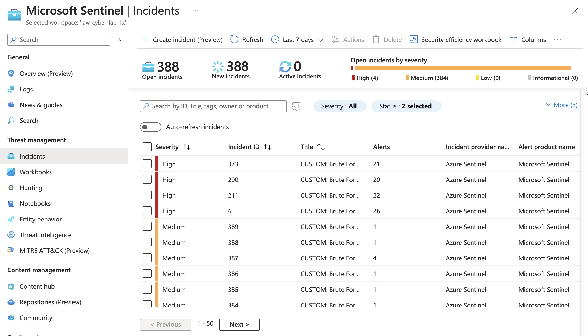

# Azure-SOC

## INTRODUCTION

#### Azure Cloud Honeynet Architecture

In this project, I created a small honeynet in Azure. I set up a Log Analytics workspace to ingest the resources' logs and connected it to Microsoft Sentinel. Within Sentinel, I built attack maps and created trigger alerts. I initially designed the network so that all traffic was allowed through. After a 72 hour period, I analyzed the incidents and events in Sentinel, responded to them, and gathered the attack metrics. After the 72 attack period, I updated my configurations in Azure to monitor the safety score of the network in comparison to NIST 800-53, then followed some of its recommendations for how to harden the environment. After hardening, I waited until the following weekend to take the after-hardening attack metrics, because I wanted to compare the metrics during similar traffic times.

#### The metrics I analyzed were:

* SecurityEvent (Windows Event Logs)
* Syslog (Linux Event Logs)
* SecurityAlert (Log Analytics Alerts Triggered)
* SecurityIncident (Incidents created by Sentinel)
* AzureNetworkAnalytics\_CL (Malicious Flows allowed into my honeynet)

#### The architecture of the mini honeynet in Azure consists of the following components:

* Virtual Network (VNet)
* Network Security Group (NSG)
* Virtual Machines (2 windows, 1 linux)
* Log Analytics Workspace
* Azure Key Vault
* Azure Storage Account
* Microsoft Sentinel

## SENTINEL - INCIDENT RESPONSE

While I had the NSGs wide open to the internet, I spent time in Sentinel with incident response. I assigned incidents to myself, investigated them and responded to them.&#x20;

Some of these incidents were marked as brute force success. Upon investigation, however, it became clear there were no successes and these were false positives. I wrote up my findings and resolved the incidents.

<figure><figcaption></figcaption></figure>

### Incident Documentation - False Positive

#### CUSTOM: Brute Force SUCCESS - Windows

* Incident ID: 373
* Dec. 11 12:45:05
* Victim: Windows VM
* Attacker IP: 3.135.207.84
* Columbus, Ohio
* Amazon Technologies, Inc.
* Seen between 12/11/23 at 1:34:02PM and 2:04:05PM

I assigned ownership, active status, and kept at high severity.

The alerts from this IP originally show two attempts followed by 21 successes at the same time stamp, followed by two more attempts about 15 minutes after the supposed success.&#x20;

While investigating this alert, I saw a note: “If you see a SUCCESS but the Account is "NT AUTHORITY\ANONYMOUS LOGON", check out this article: [https://www.inversecos.com/2020/04/successful-4624-anonymous-logons-to.html](https://www.inversecos.com/2020/04/successful-4624-anonymous-logons-to.html)”&#x20;

I looked into this article and found that when a user initiates an RDP or SMB connection, the system logs this as successful before a password is entered. The failed logins after the initial “Success” shows that this was not a successful login or brute force attack. This is a false positive.

That being said, the victim's computer is involved in many attacks originating from different IP addresses and shows signs of needing security hardening. It appears over-exposed to the internet.

Though the alert was a false positive, this type of traffic shouldn’t be reaching the VM.&#x20;

Closing Incident as False Positive. Will start process for security hardening.

## BEFORE AND AFTER METRICS

For the "BEFORE" metrics, all NSGs and built-in firewalls were designed to be completely open to the internet. All other resources had visible public endpoints.

For the "AFTER" metrics, NSGs were hardened by blocking ALL traffic with the exception of my admin workstation. All other resources were protected by their built-in firewalls as well as Private Endpoints.

## Attack Maps Before Hardening / Security Controls

<figure><figcaption></figcaption></figure>

<figure><figcaption></figcaption></figure>

<figure><figcaption></figcaption></figure>

## Metrics Before Hardening / Security Controls

The following table shows the metrics I measured in the insecure environment for 72 hours:

#### Day 1: Friday -> Saturday

| Metric     | Time (EST)            |
| ---------- | --------------------- |
| Start Time | 12/8/2023, 4:23:11 PM |
| Stop Time  | 12/9/2023, 4:23:11 PM |

| Metric                    | Count |
| ------------------------- | ----- |
| SecurityEvent             | 76895 |
| Syslog                    | 18629 |
| SecurityAlert             | 1     |
| SecurityIncident          | 238   |
| AzureNetworkAnalytics\_CL | 3270  |

#### Day 2: Saturday -> Sunday

| Metric     | Time (EST)             |
| ---------- | ---------------------- |
| Start Time | 12/9/2023, 4:23:11 PM  |
| Stop Time  | 12/10/2023, 4:23:11 PM |

| Metric                    | Count  |
| ------------------------- | ------ |
| SecurityEvent             | 137187 |
| Syslog                    | 18163  |
| SecurityAlert             | 13     |
| SecurityIncident          | 241    |
| AzureNetworkAnalytics\_CL | 5050   |

#### Day 3: Sunday -> Monday

| Metric     | Time (EST)             |
| ---------- | ---------------------- |
| Start Time | 12/10/2023, 4:23:11 PM |
| Stop Time  | 12/11/2023, 4:23:11 PM |

| Metric                    | Count |
| ------------------------- | ----- |
| SecurityEvent             | 24331 |
| Syslog                    | 36363 |
| SecurityAlert             | 8     |
| SecurityIncident          | 237   |
| AzureNetworkAnalytics\_CL | 5307  |

## Attack Maps Before Hardening / Security Controls

`After hardening, the maps yielded no results of the type of malicious activity they were monitoring.`&#x20;

## Metrics After Hardening / Security Controls

The following tables show the metrics I measured in the environment on the weekend after I applied security controls:

#### Day 1: Friday -> Saturday

| Metric     | Time (EST)             |
| ---------- | ---------------------- |
| Start Time | 12/15/2023, 4:49:51 PM |
| Stop Time  | 12/16/2023, 4:49:51 PM |

| Metric                    | Count |
| ------------------------- | ----- |
| SecurityEvent             | 11295 |
| Syslog                    | 0     |
| SecurityAlert             | 0     |
| SecurityIncident          | 0     |
| AzureNetworkAnalytics\_CL | 0     |
| Malicious Flows Denied    | 3259  |

#### Day 2: Saturday -> Sunday

| Metric     | Time (EST)             |
| ---------- | ---------------------- |
| Start Time | 12/16/2023, 4:49:51 PM |
| Stop Time  | 12/17/2023, 4:49:51 PM |

| Metric                    | Count |
| ------------------------- | ----- |
| SecurityEvent             | 8337  |
| Syslog                    | 0     |
| SecurityAlert             | 0     |
| SecurityIncident          | 0     |
| AzureNetworkAnalytics\_CL | 0     |
| Malicious Flows Denied    | 2708  |

#### Day 3: Sunday -> Monday

| Metric     | Time (EST)             |
| ---------- | ---------------------- |
| Start Time | 12/17/2023, 4:49:51 PM |
| Stop Time  | 12/18/2023, 4:49:51 PM |

| Metric                    | Count |
| ------------------------- | ----- |
| SecurityEvent             | 8172  |
| Syslog                    | 0     |
| SecurityAlert             | 0     |
| SecurityIncident          | 0     |
| AzureNetworkAnalytics\_CL | 0     |
| Malicious Flows Denied    | 2399  |

## Results

This table illustrates the change in percentage of attacks of each of the monitored types.&#x20;

| Metric                    | Change after hardening |
| ------------------------- | ---------------------- |
| Security Events           | -66.41%                |
| Syslog                    | -100.00%               |
| SecurityAlert             | -100.00%               |
| Security Incident         | -100.00%               |
| AzureNetworkAnalytics\_CL | -100.00%               |

## REFLECTIONS

I learned through this project how to set up a network on Azure, including VMs, NSGs, Log Analytics, Microsoft Sentinel, and Entra ID. I learned how to create different workbooks and attack maps based on incoming incidents. I learned to use KQL and sort through thousands of logs. I practiced responding to incidents and remediating them. I also learned to work with and apply security recommendations, specifically with NIST 800-53.

This project shows how important even the smallest steps are to hardening an environment. Only minimal hardening steps were taken, but the results were dramatic. For a network with higher needs, valuable resources, and sensitive information, I would certainly want to secure the environment further. The Azure environment was fully setup for me to easily take those next steps to secure the environment even more if need be. I also could have added different recommendations to the environment to check against those.

I would like to better understand why there are still security events after hardening: what are they, how could I stop them, and why didn't they show up on the maps. Now that I have a good visualization for this project, I would be curious to re-create this lab a 2nd time to more deeply understand it and to experiment with applying more of the NIST 800-53 recommendations.
