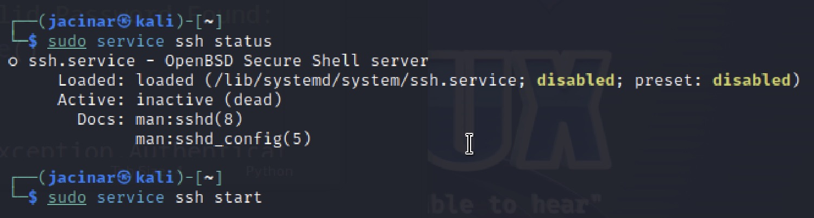
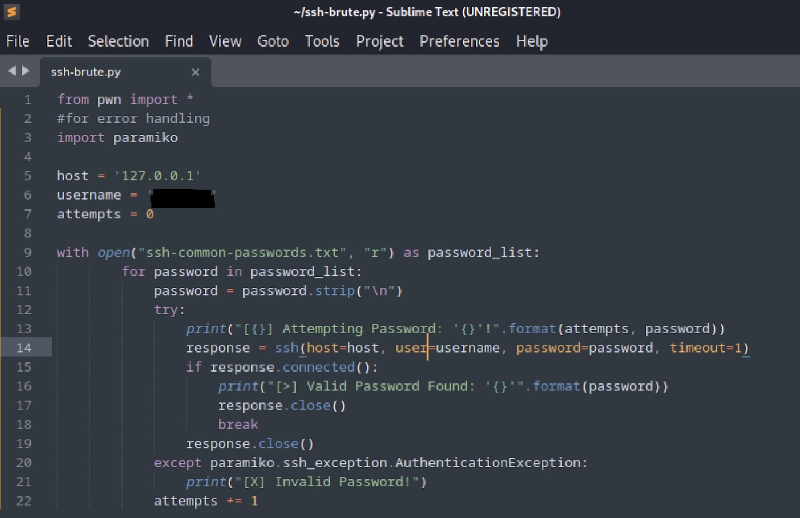
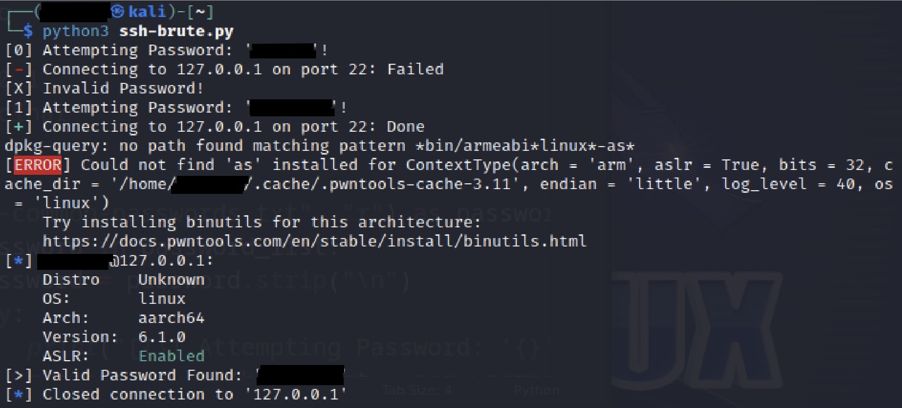

# SSH Login Brute Forcing

I created this script during TCM's Python 101 for Hackers course.

On a Kali Linux VM through UTM, I created a python script for ssh login brute forcing using Sublime. I then tested it against my localhost until it was successful.

### Download Tools

On the VM, I first ensured that Python3 was downloaded and installed pwntools.&#x20;

<figure><figcaption></figcaption></figure>

### Check SSH Connection

SSH connection on my vm was initially disabled, making the script unusable. I started the connection to make testing my brute force attack possible.

<figure><figcaption></figcaption></figure>

### Script

Within sublime, I created the script to brute force an SSH login.&#x20;

#### from pwn import \* vs from pwn import ssh

I experimented to find out why it was necessary to import \* from pwn. The ssh function, in line 14, used to establish ssh connections, is part of pwn. During this research, I figured out a better code, though. When I first ran the code with import \*, it successfully brute forced my server, but it gave an error message as well. When I rewrote the code to only import ssh from pwn, the error message resolved.

From this and further investigations, I found it is generally best practice to only import what you need rather than everything.

#### Paramiko

Paramiko is used for handling errors within the script as seen in line 20.

**Password File**

I downloaded a file with the 100 most common passwords. I then added my password into the file, so that my brute force test could be successful.

<figure><figcaption>
Code w/import * --> Gave an unexpected error
</figcaption></figure>

<figure><figcaption>
 Updated the 1st line to be more specific
</figcaption></figure>

### Test - Success

With the code updated and ssh on, the script ran with success. \
\
The top result shows the error when import \* was part of the code. The bottom result is after the code said import ssh.

<figure><figcaption>
import * result
</figcaption></figure>

<figure><figcaption>
import ssh result
</figcaption></figure>

